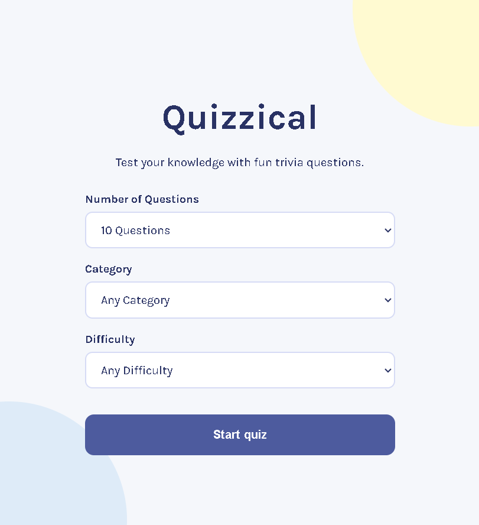
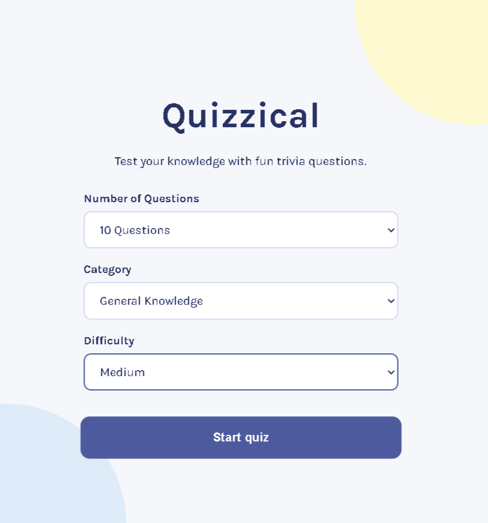
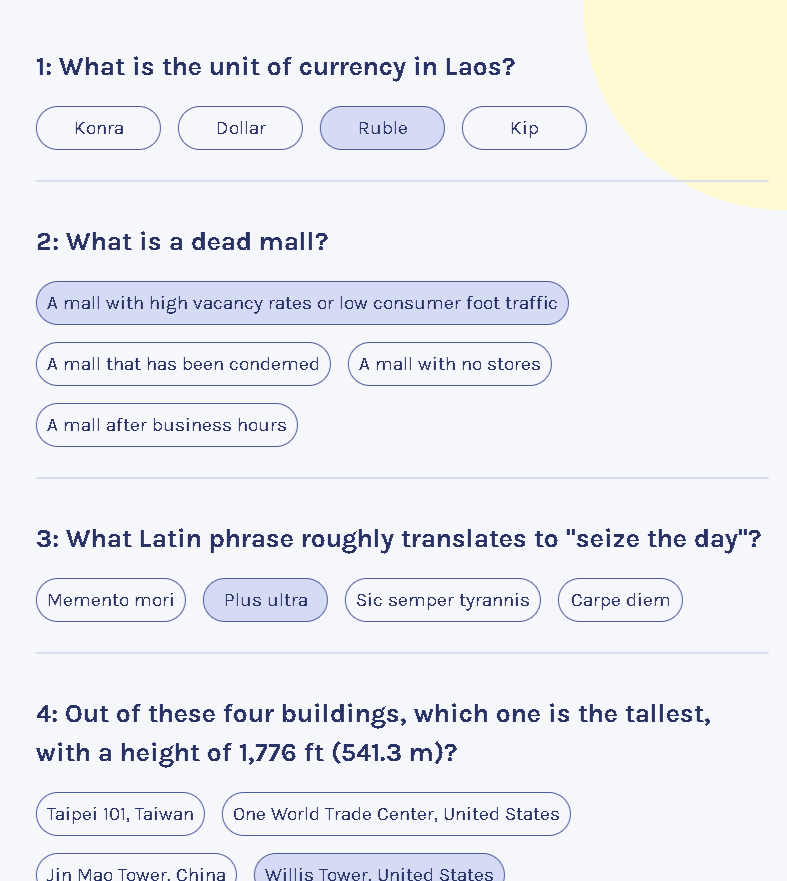
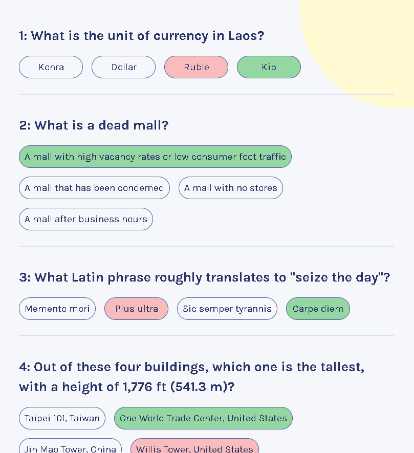
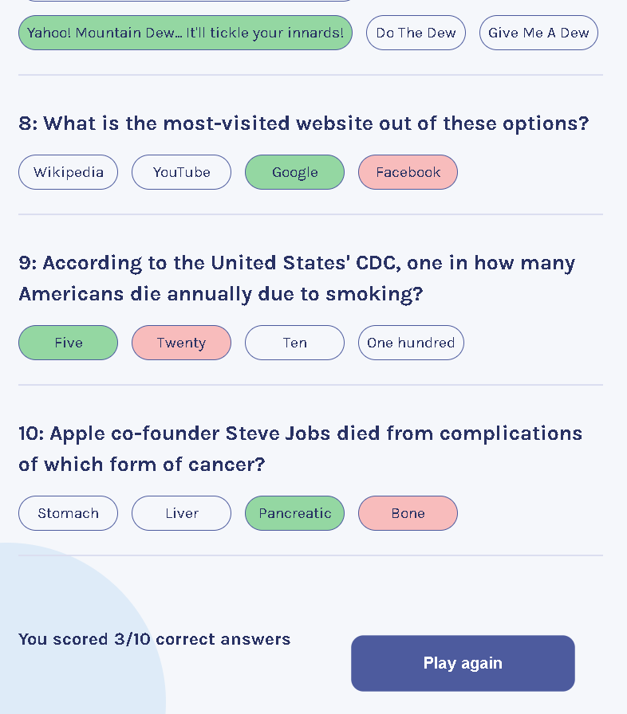

# 🧠 Quizzical — A Multiple Choice Questions App

Quizzical is a responsive trivia quiz application built with **React** that fetches real-time multiple choice questions from the Open Trivia Database API.

Users can:

* Choose quiz settings
* Answer dynamically generated questions
* Instantly check answers
* See correct & incorrect selections with visual feedback
* View their final score
* Play again with a new randomized quiz

---

# 🚀 Live Features
```
✅ Dynamic quiz generation using API data
✅ Select:

* Number of questions
* Category
* Difficulty

✅ Randomized answer order
✅ Answer selection state management
✅ Correct answers highlighted in green
✅ Incorrect selected answers highlighted in red
✅ Score calculation system
✅ Responsive modern UI
✅ Play Again functionality
```
---

# 🛠️ Built With

* React
* JavaScript (ES6+)
* CSS3
* Open Trivia Database API
* html-entities package

---

# 📸 Screenshots

## Start Screen



---

## Quiz Configuration



---

## Quiz Questions



---

## Answer Validation



---

## Final Score Screen



---

# 🧩 Core React Concepts Practiced

This project focuses heavily on modern React fundamentals including:

* `useState`
* `useMemo`
* Conditional rendering
* Dynamic styling
* Array mapping
* Derived UI from state
* Controlled interactions
* API fetching with `fetch()`
* State lifting
* Component-based architecture

---

# 🌐 API Used

Open Trivia Database API:

[Open Trivia DB](https://opentdb.com?utm_source=chatgpt.com)

---

# 📚 Learning Journey

This project was built while learning React and modern frontend development.

I’ve been learning through:

[Scrimba — Learn Frontend Development](https://scrimba.com/?via=u43a7734&utm_source=chatgpt.com)

---

# 👨‍💻 Connect With Me

LinkedIn:

[Fakhar E Alam LinkedIn Profile](https://www.linkedin.com/in/fakhar-e-alam-a046133b4/?utm_source=chatgpt.com)

---

# ⚙️ Installation

Clone the repository:

```bash
git clone https://github.com/your-username/quizzical-app.git
```

Install dependencies:

```bash
npm install
```

Run the development server:

```bash
npm run dev
```

---

# 📌 Future Improvements

* Timer system
* Difficulty badges
* Sound effects
* Dark mode
* Animated transitions
* Persistent high scores
* Better answer shuffling algorithm

---

# ⭐ If you liked this project

Feel free to:

* Star the repository
* Connect on LinkedIn
* Check out Scrimba for learning React
